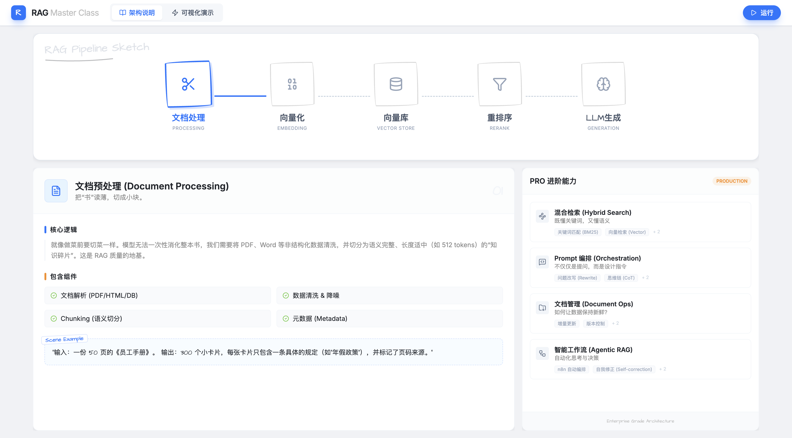

# RAG Master Class

[](https://reactjs.org/)
[](https://vitejs.dev/)
[](https://tailwindcss.com/)

一个可视化的 RAG (Retrieval-Augmented Generation) 交互式教程。通过直观的动画和实时代码演示，拆解 RAG 的核心流程。


 
 
  **在线演示**: [http://39.96.203.251:8002](http://39.96.203.251:8002)

##  功能特性

- **可视化架构**: 交互式流程图，展示 RAG 五大核心步骤。
- **实时代码演示**: 在浏览器中运行真实的 RAG 流程（基于 Mock 或 Qianwen API）。
- **手绘风格 UI**: 简约、现代、移动端适配。
- **双模式**:
  - **架构说明**: 原理拆解与技术栈推荐。
  - **可视化运行**: 实时输入/输出展示，代码逻辑透视。

##  快速开始

1. **安装依赖**
   ```bash
   npm install
   ```

2. **启动开发服务器**
   ```bash
   npm run dev
   ```

3. **访问**
   打开浏览器访问 `http://localhost:5173`

##  项目结构

```
src/
├── components/
│   ├── ProcessFlow.tsx    # 核心：可视化运行流程
│   ├── RagVisualizer.tsx  # 核心：架构流程图
│   ├── StageCard.tsx      # 知识卡片组件
│   └── ...
├── lib/
│   └── qianwen-api.ts     # API 接口封装
├── App.tsx                # 主入口
└── ...
```